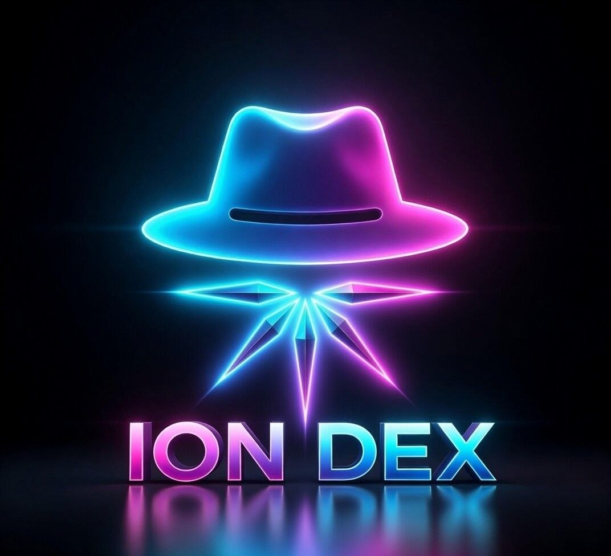

**Languages:** [English](./README.md) | [简体中文](./README.zh-CN.md) | [Español](./README.es.md) | [العربية](./README.ar.md) | [Русский](./README.ru.md)

  

<strong>This is not a typical DEX repository. It is the public front door of a long-horizon digital civilization.</strong>

<h1 align="center">ION — The Operating System for a Super Digital Civilization</h1>

<strong>Multi-chain aggregation. Frictionless payments. Unified identity. Verifiable history. Reputation, arbitration, coordination, self-evolution, and AI sentinel defense — designed as one long-horizon civilization stack.</strong>

<strong>A public front door for a system that begins with exchange infrastructure and grows into a durable digital civilization layer by layer.</strong>

  <a href="https://ice.io/">Website</a> ·
  <a href="https://explorer.ice.io/">Explorer</a> ·
  <a href="./docs">Documentation</a> ·
  <a href="#current-dex-capability-surface">DEX Capabilities</a> ·
  <a href="#long-horizon-roadmap">Roadmap</a>

> **Current Stage:** Building the infrastructure, memory, identity, proof, payment, and trust foundations before the full civilization shell.

---

## Core Selling Points

- **28-chain decentralized exchange** — a full-chain aggregation surface built around liquidity access, routing, settlement, and stronger user-facing execution.
- **Frictionless multi-chain payments** — payment complexity is pushed into the infrastructure layer so users, merchants, and platforms can transact with less fragmentation.
- **Official identity across the entire ecosystem** — ION Identity is designed to connect users, merchants, developers, service providers, proof systems, reputation systems, and coordination logic into one continuous platform fabric.
- **AI flagship stack** — AI analysis, AI-assisted arbitration, AI sentinel defense, AI-enhanced coordination, and AI self-evolutionary upgrade capacity are part of the platform’s long-term architecture.
- **Fee burn, staking, and long-term value flywheel** — platform usage is designed to support token scarcity, lock-in effects, ecosystem alignment, and long-horizon value capture.
- **API and SDK integration surface** — merchants, international e-commerce platforms, service providers, and developers are expected to connect through direct integration pathways, not just passive observation.
- **Independently developed by Master** — ION DEX’s full-chain aggregated ecosystem platform is being independently developed by Master with a singular long-horizon strategic direction.

---

## Core Gateways

- **[🌐 Official Website](https://ice.io/)**  
  The sovereign narrative entry for the ION world, worldview, and public positioning.

- **[🔎 Blockchain Explorer](https://explorer.ice.io/)**  
  The sovereign proof surface for addresses, transactions, and on-chain verification.

- **[📚 Documentation Hub](./docs)**  
  The structured entry into technical docs, system maps, build context, and public materials.

- **[📄 Whitepaper Index](./docs/whitepaper-index.md)**  
  The deeper doctrine, long-horizon system reasoning, and civilization-scale synthesis.

---

## Choose Your Entry

- **[🛒 Merchants](./docs/merchant-onboarding.md)**  
  Direct access to [Payment Access](./docs/payment-access.md), [Settlement Integration](./docs/settlement-integration.md), and commerce onboarding.

- **[🧑‍💻 Developers](./docs/developer-index.md)**  
  Start with [API Overview](./docs/api-overview.md), [Contracts Overview](./docs/contracts-overview.md), [SDK Overview](./docs/sdk-overview.md), and [Quick Start](./docs/quick-start.md).

- **[🤝 Builders & Partners](./docs/ecosystem-entry.md)**  
  Enter through ecosystem coordination, collaboration, and integration pathways.

- **[🛰️ Researchers & Community](./docs/public-structure.md)**  
  Go straight to [Roadmap Guide](./docs/roadmap-guide.md), [Whitepaper Index](./docs/whitepaper-index.md), and public structure context.

---

## Executive Summary

ION DEX starts with its clearest public business anchor: **a 28-chain decentralized exchange designed for liquidity access, routing, settlement, and frictionless multi-chain payment flow**.

That DEX is not presented as the final shape of the system. It is the first visible business engine — the layer that creates real liquidity, real value flow, real settlement logic, and a live trust foundation strong enough to support broader expansion.

Around that exchange base, the platform is being built into a larger commercial and civil stack: merchant-facing settlement rails, international e-commerce integration, developer-facing APIs and SDKs, official identity continuity, proof and trust systems, AI-assisted arbitration, AI sentinel defense, AI self-evolutionary upgrade capacity, and wider coordination across commerce and real-world services.

This is why ION DEX is not positioned as a normal DEX. A normal DEX stops at trading. ION uses trading as the first visible engine, then expands into payments, identity, proof, coordination, intelligence, and long-horizon ecosystem civilization.

That foundation is designed to attract more than traders. It is meant to attract **investors looking for platform-scale expansion**, **developers looking for a serious ecosystem to build into**, **merchants and e-commerce operators looking for stronger payment and settlement rails**, **service providers looking for earlier ecosystem positioning**, and **partners who want to connect into a larger multi-layer growth system**.

---

## Current DEX Capability Surface

ION DEX is being positioned first as a **28-chain decentralized exchange and aggregation layer**. That means the current product and business core is centered on real exchange capability rather than vague ecosystem language.

### What the DEX is built to do
- **Aggregate liquidity across chains** so users are not trapped inside isolated markets.
- **Route value more intelligently** across fragmented environments instead of forcing users to manage unnecessary complexity themselves.
- **Provide stronger settlement infrastructure** that can later support merchants, platforms, and service providers on top of the exchange core.
- **Support frictionless multi-chain payment rails** so payments and settlement can become part of a broader commercial stack, not just a trading terminal.
- **Act as the first trust and value anchor** for everything that follows, including commerce, identity, proof, arbitration, and coordination.

### Why this matters
If the DEX layer is weak, the wider platform story collapses. If the DEX layer is strong, it becomes the first living proof that the wider ecosystem can carry real value flow, real business activity, and real long-term expansion capacity.

That is why the DEX comes first. It is not a side module. It is the first product anchor, the first revenue and settlement anchor, and the first visible surface through which the rest of the ecosystem can later grow.

### What makes this DEX strategically different
The DEX is not being framed as an isolated trading interface. It is being framed as the **unified value-flow entrance** for the broader platform. That means liquidity, routing, settlement, and payments are not dead-end functions — they are the first rails on which merchant payments, e-commerce access, service integration, identity continuity, proof, arbitration, and future ecosystem coordination can later run.

---

## Future Business Expansion

### 1. Merchant Payments and Settlement Expansion
The first major expansion path after the DEX is merchant-facing payment and settlement infrastructure. The point is not to add a cosmetic payment badge, but to give merchants a stronger digital rail for receiving value, settling faster, and operating with lower fragmentation across chains.

### 2. International E-Commerce and Web3 Commerce
ION DEX is meant to become more than an exchange for traders. It is also being positioned as a future entry point for **international e-commerce platforms, cross-border sellers, Web3-native merchants, and digital commerce operators**.

Why would they care?
- Because multi-chain payment and settlement can remove friction that traditional platform payment stacks do not solve well.
- Because broader Web3 user access can create new customer reach.
- Because direct API and SDK integration can let them plug into capabilities instead of rebuilding systems from scratch.
- Because the platform is being designed as a wider ecosystem surface, not just a payment plugin.

### How international platforms and sellers can connect
The intended onboarding logic is practical:
1. start with merchant-facing payment and settlement integration,
2. connect through API and SDK layers,
3. expand into broader commerce-facing ecosystem features as they mature.

This matters because large platforms and serious sellers do not want abstract invitations. They want a path that can begin with concrete payment and settlement access, then expand into wider customer, reputation, proof, and coordination advantages over time.

### What international commerce participants can gain
A serious international e-commerce participant should be able to see multiple advantages:
- **new digital customer reach** through Web3-native traffic and platform expansion,
- **multi-chain payment access** without needing to become a chain-infrastructure expert,
- **stronger settlement flexibility** across fragmented environments,
- **earlier positioning** inside a platform still shaping its commercial surface,
- and a future path into identity, proof, AI, and ecosystem-level growth rather than a one-off checkout patch.

### 3. Offline Retail, Shopping Venues, and Physical Commerce
The platform is also intended to expand toward offline retail businesses, shopping venues, commercial service networks, and physical commerce environments that need better digital payment coordination, broader customer reach, and future-facing settlement infrastructure.

The real advantage is not just crypto checkout. It is the ability to connect payment, settlement, identity, proof, reputation, and ecosystem access into one longer-term commercial rail.

### Why physical commerce participants may care
Physical businesses need more than a novelty checkout option. They need systems that can eventually support:
- better payment flexibility,
- stronger settlement coordination,
- broader digital customer access,
- and a more unified operating surface across future ecosystem modules.

That is the difference between a temporary payment gimmick and a longer-term commerce infrastructure play.

### 4. Developer and Builder Ecosystem
Developers should be able to see a real reason to participate: APIs, contracts, SDKs, technical docs, ecosystem entry points, and a platform that is still expanding instead of freezing into a closed product shell.

This makes ION DEX more attractive to builders who want leverage, visibility, strategic depth, and the chance to build into a system whose scope is larger than a normal exchange front end. The authorship also matters here: **ION DEX’s full-chain aggregated ecosystem platform is being independently developed by Master**, which gives the project a more coherent strategic direction than a generic committee-built shell.

### 5. AI Flagship Layer
AI is one of the platform’s flagship tracks, not a decorative extra. That includes:
- AI-facing market analysis,
- intelligent operational layers,
- decision support,
- AI-assisted arbitration,
- AI sentinel defense,
- AI-enhanced ecosystem coordination,
- and self-evolving upgrade capacity.

This matters because it gives the platform not only intelligence, but also protection, adaptation, dispute handling, and long-term upgrade capacity.

### 6. Identity Infrastructure Across the Entire Ecosystem
Official identity is another core pillar. ION Identity is intended to run across the full ecosystem rather than sit beside it as an isolated feature.

Over time, identity is expected to connect:
- users,
- merchants,
- developers,
- service providers,
- proof systems,
- reputation systems,
- and coordination logic

into one continuous platform fabric.

This is one of the strongest long-term differentiators because it gives the ecosystem memory, continuity, recognizability, recoverable standing, and a stronger operating backbone across all future modules.

### 7. Identity, Proof, Trust, and AI Arbitration
Another major expansion path is the combination of **identity, proof, reputation, verification, trust systems, and AI-assisted arbitration**.

A serious platform cannot depend only on transactions. It must also be able to:
- verify,
- remember,
- establish standing,
- resolve disputes,
- handle appeals,
- and support recovery logic

across the wider ecosystem.

### 8. AI Sentinel Defense and Ecosystem Protection
AI sentinel defense is one of the strongest long-term trust and security selling points. It introduces:
- anomaly detection,
- monitoring,
- risk identification,
- defensive response logic,
- and ecosystem watch capacity.

That gives ION not only intelligence and arbitration capability, but also a visible defense and protection layer — something that matters to investors, developers, merchants, and service providers alike.

### Why this matters strategically
A future-facing platform cannot only be smart. It also has to be able to defend itself, watch for risk, and respond to disorder. AI sentinel defense helps turn the ecosystem from a merely adaptive platform into a guarded platform.

### 9. Ecosystem Coordination and Civilizational Integration
Over time, ION DEX is meant to become more than a trading or payment venue. It is being shaped as a coordination layer across:
- commerce,
- delivery,
- mobility,
- logistics,
- insurance,
- retail,
- service networks,
- and cross-border value movement.

The key point is not to create random adjacent businesses. The key point is to let these ecosystems plug into shared:
- payment rails,
- identity,
- reputation,
- proof,
- AI-assisted arbitration,
- AI defense,
- and coordination logic.

That is what makes the wider ecosystem stronger than a set of isolated apps.

### Why ecosystem integration creates stronger outcomes
When multiple business layers connect into the same identity, proof, payment, trust, and defense system, they do not merely coexist — they reinforce one another. That creates stronger coordination, cleaner handoffs, lower trust fragmentation, and a much more durable platform core than isolated service silos can provide.

### 10. API and SDK Integration Surface
A serious platform needs more than a user-facing product — it needs an integration surface.

ION DEX is expected to expose API and SDK pathways so:
- merchants,
- e-commerce operators,
- international platforms,
- service providers,
- and developers

can connect directly to payment, settlement, and future ecosystem capabilities.

This lowers onboarding friction and makes participation operational instead of theoretical.

### 11. Fee Burn, Staking, and Long-Term Value Flywheel
Participation is not driven by utility alone. It is also strengthened by economic design.

Fee burn and staking are central selling points because they connect platform usage to:
- stronger scarcity,
- long-term lock-in effects,
- ecosystem alignment,
- value capture,
- and the economic logic behind stronger token demand and long-horizon market expansion.

This is one of the clearest reasons platform growth can become more than surface activity. It creates a path through which usage, revenue, retention, and value logic begin to reinforce each other.

### 12. Why This Creates Participation Pull
For investors, this creates a platform with multiple expansion surfaces instead of a single-product ceiling.

For developers, it creates a system worth building into rather than a disposable interface.

For merchants and e-commerce operators, it creates a reason to adopt and integrate instead of merely observe.

For service providers and partners, it creates a live ecosystem to enter early, position inside, and grow with.

That participation pull is one of the real strategic strengths of ION DEX.

---

## What We Are Building

| Layer | Meaning |
|------|---------|
| **Infrastructure Layer** | DEX infrastructure, liquidity, routing, settlement, treasury, burn, staking primitives |
| **Payment Layer** | Frictionless payments, stablecoin-facing frontend, ION-integrated backend routing, fine-grained monetary expression |
| **Civil Layer** | Unified identity, official ecosystem ID continuity, reputation, civil standing, historical continuity |
| **Review & Trust Layer** | Immutable proof, explorer verification, AI-assisted arbitration, appeal, recovery |
| **Coordination Layer** | Commerce, delivery, mobility, logistics, insurance, retail, cross-border services |
| **Evolution Layer** | Self-evolving system structure, AI-enhanced operations, error memory, rule refinement, continuity-preserving adaptation |

---

## Civilization Core

At the center of ION is a simple idea:

**A digital civilization should be able to remember, identify, verify, judge, coordinate, and evolve.**

That evolution is not only institutional — it is also computational. Over time, the platform is intended to support **AI self-evolution and upgrade capacity**, so that analysis, coordination, arbitration support, operational intelligence, and ecosystem logic can improve without reducing continuity across the wider system.

---

## Participation Value by Role

### For Investors
ION DEX is not being framed as a narrow exchange product with a single ceiling. It is being framed as a platform that begins with DEX infrastructure and can later expand into payments, commerce, identity, AI, proof, service coordination, and ecosystem-level integration.

That means investors are not only looking at a trading surface. They are looking at:
- a broader commercial expansion map,
- stronger long-horizon value logic,
- fee burn and staking flywheel effects,
- and the possibility that platform growth can reinforce token demand, lock-in, and strategic positioning.

### For Developers
Developers are not being invited into a dead-end front-end task. They are being invited into:
- exchange infrastructure,
- payment rails,
- API and SDK layers,
- identity and trust systems,
- AI-assisted platform modules,
- and long-term ecosystem expansion.

That makes the platform more attractive to builders who want to work on something that can expand across multiple layers of the digital stack.

### For Merchants, E-Commerce Operators, and Offline Retail
Merchants and retailers are not supposed to see ION as only a crypto exchange. They are supposed to see:
- stronger payment and settlement rails,
- lower-friction cross-chain value flow,
- broader digital customer reach,
- future Web3 commerce integration,
- and access to a wider ecosystem instead of a one-off payment patch.

### For International Platforms and Cross-Border Sellers
International e-commerce platforms and cross-border sellers have reason to care because the platform is being shaped toward:
- API / SDK-based integration,
- multi-chain payment access,
- stronger settlement options,
- future digital commerce participation,
- and earlier positioning inside a platform that wants to unify identity, payment, proof, and ecosystem growth.

### For Service Providers and Partners
Service providers and partners have reason to enter early because early integration can create:
- earlier positioning,
- stronger ecosystem visibility,
- access to future distribution and business flow,
- coordination advantages,
- and a chance to plug into platform growth before the ecosystem becomes crowded.

---

## Economic Logic

### Fee Burn
Fee burn is one of the strongest public-facing economic selling points because it connects real platform usage to token scarcity. If activity grows, burn can grow. That creates a clearer path between platform use and long-term value compression of supply.

### Staking
Staking matters because it creates long-term alignment, lock-in, retention, and stronger reasons for users and participants to remain committed to the ecosystem rather than treat it as a disposable interface.

### Why the Flywheel Matters
Together, fee burn and staking help turn platform growth into more than headline activity. They create a structure in which:
- usage can reinforce scarcity,
- participation can reinforce alignment,
- and ecosystem growth can support stronger long-horizon value logic.

That is one of the strongest reasons ION DEX can present not only product ambition, but economic ambition.

---

## Integration Paths

### Developer Path
Start with [Developer Entry](./docs/developer-index.md), [API Overview](./docs/api-overview.md), [Contracts Overview](./docs/contracts-overview.md), [SDK Overview](./docs/sdk-overview.md), and [Quick Start](./docs/quick-start.md).

### Merchant Path
Start with [Merchant Entry](./docs/merchant-onboarding.md), [Payment Access](./docs/payment-access.md), and [Settlement Integration](./docs/settlement-integration.md).

### E-Commerce and International Platform Path
Start with merchant-facing payment and settlement integration, then expand into API / SDK-based access as platform commerce surfaces grow. The long-term aim is to let international sellers, cross-border operators, and digital commerce platforms connect into payment, settlement, and ecosystem entry layers without rebuilding everything from zero.

### What this path is meant to deliver
For serious commerce participants, this path is meant to provide:
- a practical entry point,
- lower integration friction,
- faster access to multi-chain payment rails,
- a path into broader ecosystem growth,
- and future connection to identity, trust, proof, and AI-enhanced operating layers.

### Partner and Service Provider Path
Start with [Ecosystem Entry](./docs/ecosystem-entry.md) and [Public Structure](./docs/public-structure.md), then move toward service integration, coordination participation, and future ecosystem alignment opportunities.

---

## Frequently Asked Questions

### What is ION actually building today?
ION is currently building around a **28-chain decentralized exchange foundation**: liquidity access, routing, settlement, and frictionless multi-chain payment rails. The DEX is the first live business anchor, not the final boundary of the platform.

### Why is ION more than a normal DEX?
A normal DEX stops at trading. ION uses DEX infrastructure as the first visible layer, then expands into payments, identity, proof, reputation, AI-assisted arbitration, AI sentinel defense, ecosystem coordination, and long-horizon platform evolution.

### What does 28-chain infrastructure mean in practice?
It means the platform is designed to reduce fragmented chain experience by giving users, merchants, and builders a stronger unified surface for trading, routing, settlement, and future payment and service flows.

### What is frictionless multi-chain payment flow?
It means payment complexity is pushed downward into the infrastructure layer, so the user-facing experience can become simpler while routing, settlement, and chain-level friction are handled in the background.

### Why launch the DEX first?
Because the DEX is the first revenue, liquidity, settlement, and trust anchor. It creates the commercial and technical base that later business lines can grow on top of instead of pretending that every future module is already live.

### What business areas can expand after the DEX?
Merchant payments, international and cross-border e-commerce, offline retail integration, service-provider access, API/SDK integration surfaces, AI flagship modules, identity and proof systems, arbitration, ecosystem coordination, and wider real-world service participation.

### Why should developers build here?
Because ION is not just a front-end exchange surface. It is a growing platform with APIs, contracts, SDKs, ecosystem entry points, identity and trust layers, AI modules, and long-horizon expansion space.

### Why should merchants, e-commerce operators, and offline retailers care?
Because the platform is designed to offer multi-chain payment access, easier settlement rails, future Web3 commerce integration, broader digital user reach, and a path into a larger ecosystem rather than a one-off payment plugin.

### Why should international e-commerce platforms or large sellers connect?
Because a direct API/SDK integration path can let them plug into multi-chain payment and settlement capabilities, future Web3 commerce flows, broader digital customer access, and a long-term ecosystem with stronger growth and coordination potential.

### Why should service providers and partners enter early?
Because they can integrate before the ecosystem becomes crowded, gain earlier positioning, connect services into a broader commercial network, and benefit from platform growth, distribution, and expanding business surfaces.

### Why do fee burn and staking matter?
Because they are not cosmetic tokenomics. They are core selling points that connect platform usage to scarcity, lock-in, ecosystem alignment, long-term participation, and the economic logic behind stronger value capture.

### Why do AI, AI arbitration, AI sentinel defense, and AI self-evolution matter?
Because they push the platform beyond being a normal trading venue. They introduce intelligence, structured dispute handling, defense, adaptation, long-term upgrade capacity, and ecosystem protection into the platform itself.

### Why does official identity matter so much?
Because official ecosystem identity is intended to run across users, merchants, developers, service providers, proof systems, reputation, and coordination. It gives the platform continuity, recognizability, memory, and a stronger long-term operating fabric.

### Who is developing ION DEX?
**ION DEX’s full-chain aggregated ecosystem platform is being independently developed by Master.** That matters because the platform is not presented as a generic template or a committee-built shell. It is being pushed as a coherent long-horizon system with a singular strategic direction.

### If I want to participate now, where do I start?
- **Investors / observers** → start with the [Whitepaper](./docs/whitepaper-index.md), [Roadmap Guide](./docs/roadmap-guide.md), [Public Structure](./docs/public-structure.md), and [Explorer](https://explorer.ice.io/)
- **Developers** → start with [Developer Entry](./docs/developer-index.md), [API Overview](./docs/api-overview.md), [Contracts Overview](./docs/contracts-overview.md), [SDK Overview](./docs/sdk-overview.md), and [Quick Start](./docs/quick-start.md)
- **Merchants / e-commerce / retail** → start with [Merchant Entry](./docs/merchant-onboarding.md), [Payment Access](./docs/payment-access.md), and [Settlement Integration](./docs/settlement-integration.md)
- **Partners / service providers** → start with [Ecosystem Entry](./docs/ecosystem-entry.md) and [Public Structure](./docs/public-structure.md)

---

## Final Note

ION should not be judged only by whether it resembles a familiar category.

The deeper question is whether it is capable of becoming a durable digital civilization stack — one that begins with infrastructure, then grows into identity, proof, payment, reputation, arbitration, coordination, and long-term evolution.

That is the standard we are building toward.
