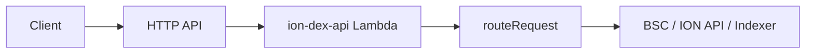

# ION DEX 后端 — AWS Serverless（SAM）Phase 1

将现有单体 Node.js 网关（`routeRequest`）以 **lift-and-shift** 方式部署到 **API Gateway HTTP API + 单个 Lambda**，无需先拆微服务。

## 目录结构

```
backend/
  serverless/
    template.yaml          # SAM 基础设施模板
    DEPLOY-GUIDED.md       # testnet / prod deploy --guided 参数清单
    samconfig.toml.example # 部署参数示例（含 testnet / prod profile）
    events/
      health-get.json      # APIGW v2 事件，供 sam local invoke 测试
    handlers/
      gateway.ts           # Lambda 入口：APIGW → IncomingMessage → routeRequest
      health-fast.ts       # 冷启动快路径：OPTIONS + GET /api/health（无 DB 时）
  .samignore               # 打包排除 legacy-makefile、tests 等（减小 Lambda 包）
  scripts/
    sam-build-win.mjs      # Windows 推荐：build + sam build（nodejs22.x 原生构建）
```

历史遗留 makefile 构建已归档至 [`legacy-makefile-build/`](./legacy-makefile-build/DEPRECATED.md)（含 `Makefile`、`make.cmd`、`sam-build-artifacts.*` 等）。当前模板使用 `Metadata.BuildMethod: nodejs22.x`，Windows 日常构建请用 `npm run sam:build:win`。归档目录由根目录 [`../.samignore`](../.samignore) 排除，不会进入 Lambda 部署包。

## 前置条件

- [AWS CLI](https://aws.amazon.com/cli/) 与 [SAM CLI](https://docs.aws.amazon.com/serverless-application-model/latest/developerguide/install-sam-cli.html)
- Node.js 22+（与 Lambda `nodejs22.x` 对齐）
- **本地 invoke / start-api**：Docker Desktop（SAM 使用 `public.ecr.aws/lambda/nodejs:22-rapid-x86_64` 等镜像）
- **Windows**：使用 `npm run sam:build:win`，**无需 GNU make**
- 分环境部署参数见 [DEPLOY-GUIDED.md](./DEPLOY-GUIDED.md)

## 跳过 AWS 认证（仅本地验证模板）

无需 `aws configure` 即可校验模板语法与构建产物：

```powershell
cd backend
npm install
npm run build
npm run sam:validate
npm run sam:build:win
```

`npm run sam:build` 等价于 `npm run build && sam build`（Linux/macOS 同样适用）。

构建成功后，产物位于 `.aws-sam/build/`，后续 local 命令应指向 **`.aws-sam/build/template.yaml`**（不是源 `serverless/template.yaml`）。

## 本地 Lambda 测试

### 单次 invoke（推荐先跑通）

```powershell
cd backend
sam local invoke IonDexApiGatewayFunction `
  -t .aws-sam/build/template.yaml `
  -e serverless/events/health-get.json
```

期望输出含 `"statusCode": 200` 与 `"status":"ok"`。`GET /api/health` 在 `ION_DB_DRIVER=disabled` 时走 **health-fast 快路径**，本地 invoke 耗时通常 **<500ms**（完整路由仍可能 8–11s 冷启动）。末尾 `Failed to get next invocation` 为单次 invoke 的正常提示，可忽略。

### 本地 HTTP API

需 Docker；首次冷启动约 8–10 秒：

```powershell
cd backend
npm run sam:build:win
sam local start-api -t .aws-sam/build/template.yaml --port 3001 --warm-containers EAGER
```

另开终端：

```powershell
Invoke-RestMethod http://127.0.0.1:3001/api/health
```

或使用 `npm run sam:local`（默认端口 3000，若与前端冲突请自行加 `--port`）。

## 配置 AWS 凭证后部署

1. 配置凭证（任选其一）：
   - `aws configure`（Access Key + Secret）
   - 或 SSO / IAM Identity Center：`aws configure sso`
   - 或使用环境变量 `AWS_ACCESS_KEY_ID` / `AWS_SECRET_ACCESS_KEY` / `AWS_REGION`

2. 复制并编辑部署配置：

   ```powershell
   copy serverless\samconfig.toml.example serverless\samconfig.toml
   ```

3. 首次部署（guided）— 参数分档见 `serverless/DEPLOY-GUIDED.md`：

   ```powershell
   cd backend
   sam deploy --guided -t serverless/template.yaml
   ```

   或使用封装脚本（需已配置凭证 + `serverless/samconfig.toml`）：

   ```powershell
   npm run sam:deploy:testnet
   ```

   testnet / prod 可使用 config profile：

   ```powershell
   sam deploy --config-env testnet -t serverless/template.yaml --config-file serverless/samconfig.toml
   sam deploy --config-env prod -t serverless/template.yaml --config-file serverless/samconfig.toml
   ```

4. 后续部署：

   ```powershell
   npm run sam:build:win
   sam deploy -t serverless/template.yaml --config-file serverless/samconfig.toml
   ```

部署成功后，`Outputs.ApiEndpoint` 即为 API 根 URL；`HealthCheckUrl` 指向 `/api/health`。

## 环境变量（CloudFormation 参数）

| 参数 | 对应运行时 env | 说明 |
|------|----------------|------|
| `IonDataMode` | `ION_DATA_MODE` | `live` / `auto` / `test-mock` |
| `DbDriver` | `ION_DB_DRIVER` | `disabled` / `sqlite` / `postgres` |
| `PostgresUrl` | `DATABASE_URL` | `DbDriver=postgres` 时必填 |
| `BscRpcUrl` | `BSC_RPC_URL` | BSC RPC |
| `CmcApiKey` | `CMC_API_KEY` | CoinMarketCap（可选） |
| `LambdaArchitecture` | — | 本地 Windows 默认 `x86_64`；AWS Graviton 可选 `arm64` |

敏感值请用 SAM deploy 参数或 AWS Secrets Manager 注入，**不要**写入仓库。

Lambda 上 **勿用 sqlite**（只读文件系统）；testnet 建议 `DbDriver=disabled`，prod 使用 `postgres` + `PostgresUrl`。

## 架构说明（Phase 1）



Phase 2 可按域拆分为多个 Lambda（价格、DNS、staking 等）；当前方案最小改动、最快上线。

## 故障排查

| 现象 | 处理 |
|------|------|
| Cursor 报 `ERROR_BAD_USER_API_KEY` | **与 AWS 无关**；在 Cursor 设置中重新登录账户或更新 User API Key |
| Windows `sam build` GBK/Unicode 错误（旧 makefile 构建） | 确认 `template.yaml` 使用 `BuildMethod: nodejs22.x`，运行 `npm run sam:build:win` |
| `sam local` 找不到镜像 | 首次 invoke 会自动拉取 `public.ecr.aws/lambda/nodejs:22-rapid-x86_64`；需 Docker 可访问 ECR |
| `sam local start-api --skip-build` 失败 | 必须先 `npm run sam:build:win`，且 `-t` 指向 `.aws-sam/build/template.yaml` |
| Lambda 502 / 超时 | 检查 CloudWatch Logs；非 health 路由冷启动 + DB bootstrap 可能需提高 `MemorySize` 或 `Timeout` |
| Postgres 连接失败 | 确认 `DbDriver=postgres` 且 `PostgresUrl` 在 VPC/安全组可达 |
| prod 部署 arm64 与本地 x86 构建 | 本地默认 `LambdaArchitecture=x86_64`；prod guided 中可改为 `arm64`，需在 Graviton 区域部署 |
