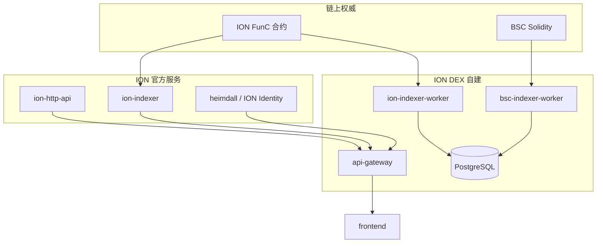

# 19 — 官方集成与数据权威

> 单页设计 | 关联：`docs/01-official-addresses-and-assumptions.md`、`docs/12-indexer-and-data-pipeline.md`

## 目标

- 冻结 **ion-http-api、ion-indexer、heimdall** 与 ION DEX 自建组件的职责边界。
- 给出 **谁 authoritative**（资金、余额、历史、身份）的决策图，避免双写与漂移。
- 指导 P0-4 / Phase 4 是 **克隆官方 indexer** 还是 **自建轻量索引**。

## 边界

| 范围内 | 范围外 |
|--------|--------|
| 集成架构、API 消费方式、fallback | 运营官方节点 |
| 仓库 clone / 版本 pin 策略 | 修改 ION 核心链代码 |

## 依赖

- `docs/10` RPC / API 端点
- `ice-blockchain/*` 仓库可用性（见 `docs/01`）

## 决策图（建议默认）

### 权威矩阵

| 数据类型 | 权威来源 | ION DEX 角色 |
|----------|----------|--------------|
| 用户余额（展示） | 链上 RPC / tonlib（实时） | 读 + 缓存 |
| Swap/Pool 历史 | **PostgreSQL indexer**（自建） | 写 worker；可选对照 `ion-indexer` |
| DNS / 域名 | 官方 resolver + indexer | 读 API，不猜 `dns.ice.io` 私有 API |
| ION ID / KYC Pass | **Heimdall** | 只存 attestation 元数据（`docs/15`） |
| 行情条 | CMC（展示） | 后端代理；**非结算**（`docs/13`） |
| 结算价 | AMM 储备 + TWAP | 合约 + oracle 包 |
| 桥状态 | 自建 `bridge_transfers` + 链上事件 | relayer 写入 |

### 集成路径（按优先级）

| 仓库 | Phase | 动作 |
|------|-------|------|
| `ion-http-api` | P0-4 | 评估 REST 是否满足 swap 模拟；不足则 tonlib 直连 |
| `ion-indexer` | Phase 4 | **Fork/部署** 或对照其 schema；不重复造 NFT/Jetton 解析 |
| `heimdall` | M3 | OAuth/verify API 对接 Identity 服务 |
| `ion-framework` | M1+ | 仅钱包连接参考，不嵌入 Flutter |
| `ion-address-book` | P0-6 前 | 导入 confirmed 地址到 Config Registry |

## Fallback 策略

| 故障 | 行为 |
|------|------|
| ion-indexer 滞后 | API 返回 `degraded` + `lag_blocks`；禁止大额桥 |
| heimdall 不可用 | KYC 门控功能降级为「未验证」 |
| CMC 限流 | 使用缓存 ticker；swap 仍用链上模拟 |

## 退出标准

- [ ] ADR 记录在 `docs/19` 或 `docs/adr/001-data-authority.md`（1 页）。
- [ ] `docs/01` 每项 Pending 有对应 owner（API / 合约 / 运维）。
- [ ] Phase 4 启动前：决定「自建 indexer only」vs「官方 indexer + 同步」。
- [ ] `GET /api/health` 暴露各上游 `status`（http-api, indexer, heimdall, cmc, rpc）。
