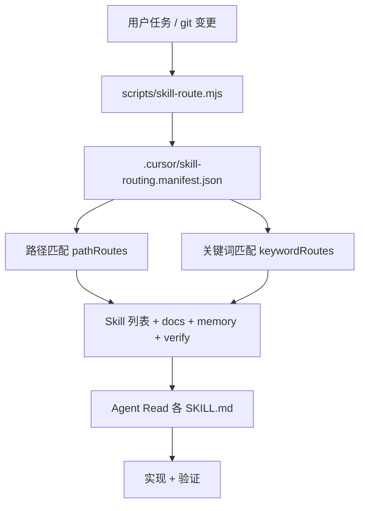

# Cursor Skill Autopilot

ION DEX 使用 **manifest + CLI + Rule + Skill** 四层结构，让 Agent 开发任意板块时自动加载对应 Cursor Skills。

## 架构



| 层 | 文件 | 作用 |
|----|------|------|
| Rule | `.cursor/rules/ion-skill-autopilot.mdc` | `alwaysApply`：强制先跑路由 |
| Skill | `.cursor/skills/ion-skill-autopilot/SKILL.md` | Agent 操作手册 |
| Manifest | `.cursor/skill-routing.manifest.json` | 路径/关键词 → Skill 映射表 |
| CLI | `scripts/skill-route.mjs` | 可脚本化、可接 CI/Hook |

## 日常使用

```bash
node scripts/skill-route.mjs --git
node scripts/skill-route.mjs --task "Swap 页 AI 行情模块"
```

`dev-preflight` 默认在末尾打印路由提示（`ION_SKILL_ROUTE=0` 可关闭）。

## 私有 Skill

闭源 Skill 安装在 `ion-private-core/.cursor/skills/`，通过 junction 暴露为：

`ion-dex-nuke/.cursor/skills-private/`

链接命令：

```powershell
d:\openclaw-tools\ion-private-core\scripts\link-skills-to-ion-dex.ps1
```

## 新增板块 checklist

1. 在 manifest 增加 `pathRoutes` 条目（`priority` 越大越优先）。
2. 创建 `.cursor/skills/<name>/SKILL.md`（或私有仓）。
3. `node scripts/skill-route.mjs --paths <path> --json` 验证。
4. 勿把商业机密 Skill 推送到公开远程。

## Cursor Hooks

| 示例文件 | 包含事件 |
|----------|----------|
| `docs/cursor-hooks-skill-route-session-only.sample.json` | 仅 `sessionStart` |
| `docs/cursor-hooks-ion-dex.sample.json` | `sessionStart` + `subagentStart` + `preToolUse`（Task）+ 可选 `stop` |

- **主会话**：`ion-skill-route-session.mjs` → 缓存 `.cursor/hooks/.ion-skill-route-last.json`
- **Task 子代理**：`ion-skill-route-subagent.mjs` + `ion-skill-route-task-pretool.mjs`（前缀写入 `prompt`，推荐）→ 缓存 `.cursor/hooks/.ion-skill-route-last-subagent.json`

详见 `docs/08-ci-agent-automation.md`。

## GitHub 每日高星发现

- Skill：`.cursor/skills/ion-github-daily-discovery/SKILL.md`
- 文档：`docs/github-daily-discovery.md`
- 路由：`keywordRoutes` → `kw-github-daily`；`pathRoutes` → `github-daily`

## 相关

- `AGENTS.md` — Required Skill 首条为 autopilot
- `docs/08-ci-agent-automation.md` — Hook 安装与 stop 验证
- `docs/github-daily-discovery.md` — 每日 GitHub 扫描与 vendor 安装
