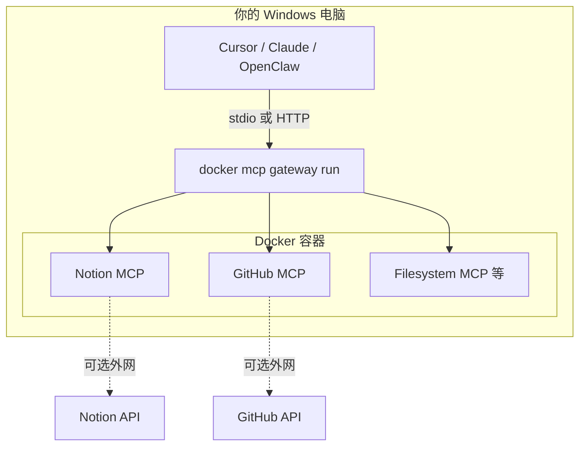

# 本机 Docker + MCP Gateway（完全自控 / 内网）

与 [E2B 云沙箱](e2b-docker-mcp-quickstart.md) 不同：所有 MCP 容器、密钥、网关都在**你自己的机器**上跑，数据不出本机（除非某个 MCP 本身要访问外网 API）。

官方入口：

- [Get started with Docker MCP Toolkit](https://docs.docker.com/ai/mcp-catalog-and-toolkit/get-started/)
- [MCP Catalog（Hub）](https://hub.docker.com/mcp)
- [mcp-gateway 源码/CLI](https://github.com/docker/mcp-gateway)

---

## 架构（本机）



要点：

- **一个 Gateway** 对接 AI 客户端；背后按 **Profile** 挂多个 MCP 容器。
- API Key 由 Docker MCP Toolkit **本地保管**，不经过 E2B/第三方沙箱。
- **内网场景**：Gateway 可只监听 `127.0.0.1`；若给局域网其他机器用，再开 `--port` + `--transport streaming`（需自建访问控制）。

---

## 前置条件（你当前机器）

在本仓库所在环境执行 `docker --version` 若报错「找不到命令」，需先安装：

1. [Docker Desktop for Windows](https://docs.docker.com/desktop/setup/install/windows-install/)（建议 **4.62+**）
2. 安装后重启，确认 PowerShell 能执行：

```powershell
docker --version
docker mcp --help
```

`docker mcp` 随新版 Docker Desktop 自带；没有则需升级 Desktop。

---

## 第一步：启用 MCP Toolkit

1. 打开 **Docker Desktop** → **Settings** → **Beta features**
2. 勾选 **Enable Docker MCP Toolkit** → **Apply**
3. 左侧进入 **MCP Toolkit**

学习路径（界面内）：**Profiles** → **Catalog** 加服务 → **Clients** 连 Cursor。

---

## 第二步：建 Profile（建议按项目分）

例如为 ION DEX 建 `ion-dex`：

1. **MCP Toolkit** → **Profiles** → **Create profile** → 名称 `ion-dex`
2. **Catalog** 里添加常用服务（按需）：
   - **Notion**（填 `NOTION` 集成 Token）
   - **GitHub Official**（填 PAT）
   - **Filesystem**（限定只读目录，勿挂整个 `C:\`）
3. 带 **Configuration Required** 的服务必须先填密钥，否则不会启动。

旧版升级用户：可能已有 **`default`** Profile，可继续用或新建 `ion-dex`。

---

## 第三步：接到 Cursor（本仓库）

### 方式 A（推荐）：Docker Desktop 一键 Connect

1. **MCP Toolkit** → **Clients** → 找到 **Cursor** → **Connect**
2. 选择 Profile：`ion-dex`（或 `default`）
3. 重启 Cursor → **Settings → Tools & MCP**，应看到 **`MCP_DOCKER`**

### 方式 B：CLI 一键（与 Desktop Connect 等效）

在项目根目录执行（`--profile` 换成你在 Desktop 里建的 profile 名）：

```powershell
& "C:\Program Files\Docker\Docker\resources\bin\docker.exe" mcp client connect cursor --profile dev_workflow
```

成功后 **重启 Cursor**。本仓库已连接 Profile **`dev_workflow`**（含 GitHub Official 等）。

### 方式 C：手写项目 `.cursor/mcp.json`

与现有 `hermes-agent`、`ion-dex-memory-bank` **并存**，增加一项即可。

Windows 若 `docker` 不在 PATH，请用 **docker.exe 全路径**（与 Connect 写入的 `docker` 二选一）：

```json
{
  "mcpServers": {
    "MCP_DOCKER": {
      "command": "C:\\Program Files\\Docker\\Docker\\resources\\bin\\docker.exe",
      "args": ["mcp", "gateway", "run", "--profile", "dev_workflow"],
      "env": {
        "LOCALAPPDATA": "C:\\Users\\admin\\AppData\\Local",
        "ProgramData": "C:\\ProgramData",
        "ProgramFiles": "C:\\Program Files"
      }
    }
  }
}
```

将 `admin` 换成你的 Windows 用户名。Windows 上若 Gateway 启动失败，多半是缺少上述 `env`（Docker 官方博客有说明）。

验证：在 Cursor 里问「用 GitHub MCP 列出我某仓库的 open issues」或「用 Notion 搜索数据库」。

---

## 第四步：命令行（不依赖 Desktop UI）

```powershell
# 查看 profile
docker mcp profile list

# 前台跑网关（stdio，给 Cursor 用）
docker mcp gateway run --profile ion-dex

# 本机 HTTP（仅本机调试）
docker mcp gateway run --profile ion-dex --port 8080 --transport streaming
```

---

## 内网 / 完全自控注意点

| 目标 | 做法 |
|------|------|
| 数据不出本机 | 只用 Filesystem、内网 DB、自建 MCP；不添加 Notion/GitHub 等公网 MCP |
| 镜像离线 | 在有网的机器 `docker pull` Catalog 镜像，导出 tar，内网 `docker load`（或私有 Registry） |
| 密钥 | 在 Docker Desktop MCP 配置里填，不写进 Git；`.env` 勿提交 |
| 局域网共用 Gateway | `gateway run --port 8080 --transport streaming` + 防火墙仅允许内网 IP；前面加反向代理 + 认证 |
| WSL2 / 无 Desktop 后端 | 设置 `DOCKER_MCP_IN_CONTAINER=1` 绕过 Desktop 特性检测（见 [mcp-gateway README](https://github.com/docker/mcp-gateway)） |
| 与 OpenClaw | OpenClaw 支持 HTTP MCP 时，可指向本机 `http://127.0.0.1:8080/...`（以你网关实际路径为准） |

**Catalog 首次添加服务**通常需要拉镜像（访问 Docker Hub）。纯隔离内网需提前做镜像同步，或自建 [Custom MCP servers](https://e2b.dev/docs/mcp/custom-servers) 进 Profile。

---

## 和 E2B / 你现有 MCP 对比

| | 本机 Docker MCP Gateway | E2B 云沙箱 | Cursor 插件（如 Notion） |
|--|-------------------------|------------|---------------------------|
| 运行位置 | 本机容器 | 云端 VM | 本机进程 |
| 需 Docker Desktop | 是 | 否 | 否 |
| 多 MCP 统一入口 | Gateway | 云端 Gateway URL | 每个插件单独 |
| 内网自控 | 强 | 弱（数据在 E2B） | 中 |
| 适合 | 内网、合规、本地密钥 | 隔离跑 Agent、批任务 | 日常 IDE 单服务 |

你项目里已有 `.cursor/mcp.json`（`hermes-agent`、`desktop-commander`、`ion-dex-memory-bank`）。装上 **MCP_DOCKER** 后是**多路并存**，不是替换 Hermes。

**注意**：`docker mcp client connect cursor` 会**重写** `.cursor/mcp.json`，可能去掉 `hermes-agent`。完整四路配置见 `.cursor/mcp.reference.json`；恢复 Hermes 请运行：

```powershell
powershell -NoProfile -ExecutionPolicy Bypass -File scripts\merge-cursor-mcp-hermes.ps1
```

然后重启 Cursor。

---

## 推荐落地顺序（Windows）

1. 安装 **Docker Desktop 4.62+**，确认 `docker mcp` 可用  
2. 启用 **MCP Toolkit**，建 Profile `ion-dex`，先加 **1～2 个** MCP（如 GitHub + Notion）验证  
3. **Clients → Connect Cursor**，或改 `.cursor/mcp.json`  
4. Cursor 里测一条工具调用  
5. 再按需加 Filesystem、Playwright 等；内网环境提前规划镜像离线  

---

## 故障排查

| 现象 | 处理 |
|------|------|
| `docker` 不是内部或外部命令 | 安装 Docker Desktop，勾选 WSL2/Hyper-V（按安装向导） |
| Cursor 里 MCP_DOCKER 红/起不来 | 补全 `LOCALAPPDATA` 等 `env`；Desktop 里确认 Profile 已配置密钥 |
| 工具列表空 | Catalog 里服务是否加入当前 Profile；是否点了 Connect 对应 Profile |
| 拉镜像失败 | 代理/镜像加速；内网则改用离线 tar |
| 与 Hermes 冲突 | 不会冲突；若 CPU 高，可在 Cursor 里临时关掉不用的 MCP |

---

## 相关文件

- 云沙箱示例（非本机 Docker）：`tools/mcp-e2b-quickstart/`
- 本仓库 Cursor MCP：`/.cursor/mcp.json`
- OpenClaw 远域云绑定：`docs/yuanyu-glm-api-binding.md`
